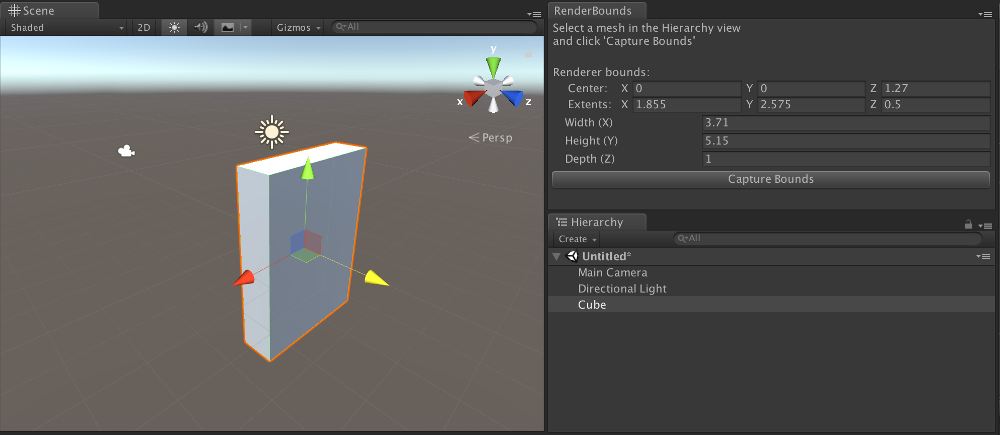

# Unity Render Bounds
An editor tool to show dimensions of Game Objects and Game Object Groups.

When working with scaled objects in unity, especially with nested Game Objects that might have different scales applied, it can be helpful to know what the absolute bounding box dimensions are of something without having to write scripts to output size.

This quick tool gives you the global bounding dimensions of the selected object's renderer and all nested (child) renderers.

## How to use

Place the script into `Assets/Editor` or install the [unitypackage](https://github.com/luxloop/UnityRenderBounds/releases/).

Once the script is imported and compiled, you can open the new `RenderBounds` pane via the `Window` menu under `Window > Show Render Bounds`.

Select any Game Object with a `Renderer` component in the Hierarchy and press the `Capture Bounds` button to update the dimensions shown in the pane.

